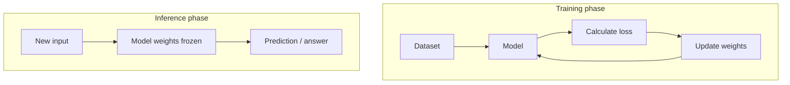
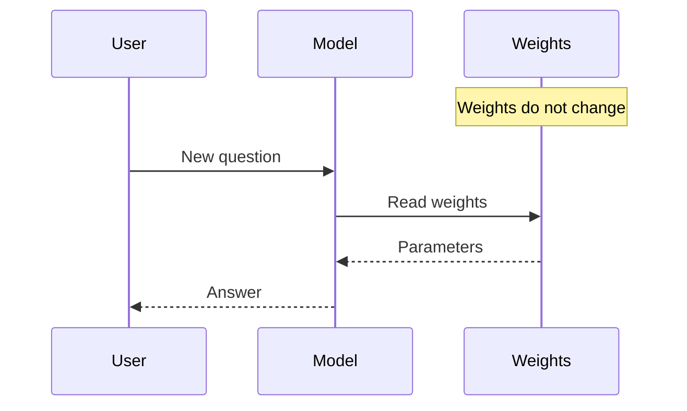

# Training vs Inference

| Aspect       | Training                             | Inference                                           |
| ------------ | ------------------------------------ | --------------------------------------------------- |
| Purpose      | Learn from data                      | Use what was learned                                |
| Input        | Large datasets with examples         | New, unseen data                                    |
| Output       | A trained model (updated parameters) | Predictions, classifications, generated content     |
| Compute cost | Usually very high                    | Usually much lower                                  |
| Frequency    | Done occasionally                    | Done every time the model is used                   |
| Example      | Teaching a model to recognize cats   | Asking the model whether a new photo contains a cat |

## Training

During training, the model is shown many examples and adjusts its internal parameters to reduce errors.

For example:

1. You provide millions of labeled images of cats and dogs.
2. The model makes guesses.
3. The training algorithm measures mistakes and updates the model's parameters.
4. After many iterations, the model becomes good at distinguishing cats from dogs.

For large AI models, training can take weeks or months and require thousands of GPUs.

**Local lab:** run `ollama/train_model.py` on CPU with a small model to see this loop in action.

## Inference

Inference is when the trained model is used to make predictions.

Examples:

- Uploading a photo and getting "cat" or "dog."
- Asking an AI agent a question and receiving an answer.
- A recommendation system suggesting a movie.

The model's parameters are generally **fixed** during inference; it applies what it already learned.

## When to use which

| Goal | Use |
|------|-----|
| Teach new behavior / style | Training / LoRA (`train_model.py`) |
| Answer from your documents | RAG (`rag.py`) — no weight updates |
| Chat with a base model | Inference via Ollama |
