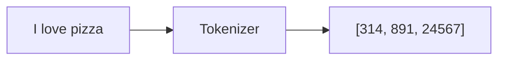
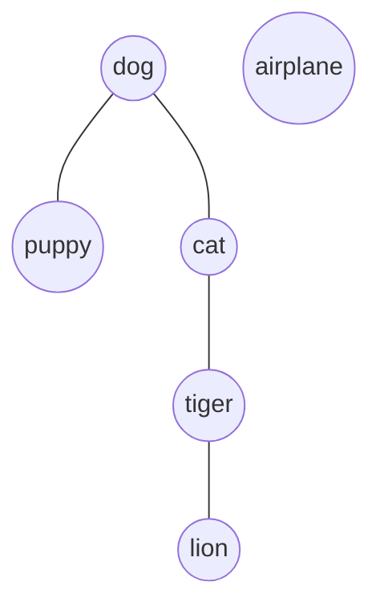
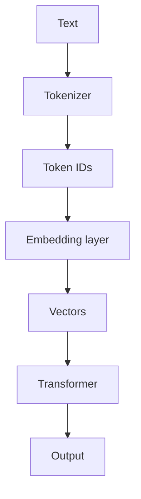
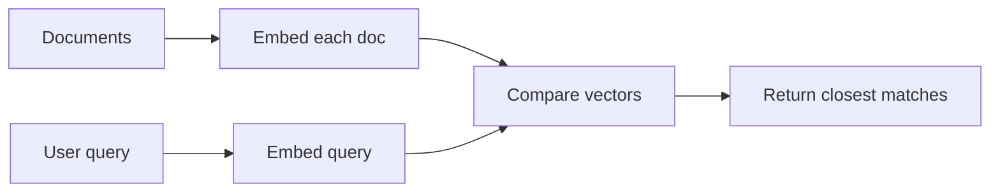

# Tokens & Embeddings

Tokens and embeddings are two fundamental concepts in modern AI models, but they serve very different purposes.

## Tokens

A token is a chunk of text that a model processes.

Text is broken into tokens before it can be understood by the model.

| Text                 | Possible Tokens                      |
| -------------------- | ------------------------------------ |
| "Hello"              | `["Hello"]`                          |
| "ChatGPT is awesome" | `["Chat", "GPT", " is", " awesome"]` |
| "2025"               | `["202", "5"]` or similar            |

The exact tokenization depends on the model.

### Why use tokens?

Models don't directly read characters or words. They operate on token IDs.



### Token limits

When people say a model has a "128k context window," they mean it can process about 128,000 tokens at once.

Rough rule of thumb:

- 1 token ≈ ¾ of a word in English
- 100 tokens ≈ 75 words
- 1,000 tokens ≈ 750 words

## Embeddings

An embedding is a numerical vector that represents the meaning of text.

Instead of storing words as IDs (`pizza → 24567`), the model represents them as a vector:

```
pizza → [0.12, -0.84, 0.31, ...]
```

This vector captures semantic meaning.

### Key idea

Texts with similar meanings get embeddings that are close together.



Similar concepts cluster together. Embeddings place text in a high-dimensional version of this map.

## How tokens become embeddings



Example: `"I love coffee"`

```
Tokens:  ["I", " love", " coffee"]
IDs:     [40, 821, 14952]
Embeddings: 3 vectors of floats
```

## Semantic search (common use of embeddings)

Suppose you have documents:

- "How to bake bread"
- "Machine learning basics"
- "Making sourdough"

A user searches: `"bread recipe"`



Instead of matching exact words, the system returns semantically similar documents — even when wording differs.

This is the basis of RAG and AI search systems. See `ollama/rag.py`.

---

**Summary**

- **Tokens** = how the model reads text (word pieces → IDs)
- **Embeddings** = how the model represents meaning mathematically (IDs → vectors)
