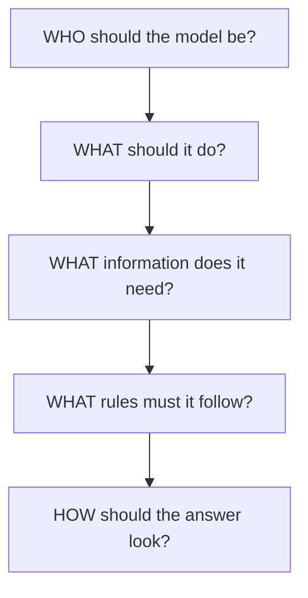
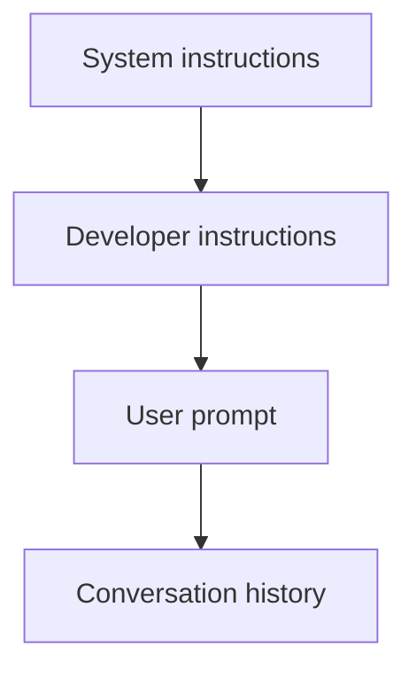
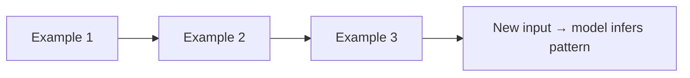
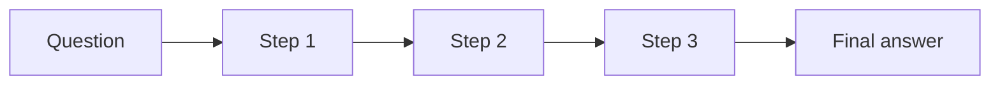

# Prompt Engineering

Prompt structure is the way you organize instructions and context so an LLM can produce the result you want.

## Prompt building blocks



### Weak vs strong

**Weak:** `Write something about databases.`

**Strong:**

```
You are a database instructor.
Explain SQL vs NoSQL.
Audience: Beginner developers.
Requirements: simple language, examples, comparison table.
Length: 500 words maximum.
```

### Structure template

```
Role → Task → Context → Constraints → Output Format
```

## Message hierarchy



The model sees all of these layers when generating a response.

## Few-shot prompting

Instead of describing the pattern, show examples.

```
Input: Cat    → Output: Animal
Input: Rose   → Output: Plant
Input: Eagle  → Output: ?
```



## Zero-shot prompting

No examples — describe the task directly.

```
Classify the following word as Animal, Plant, or Object:
Eagle
```

## Chain-of-thought prompting

Ask the model to reason step by step.

```
Solve this problem step by step.
Show assumptions, intermediate reasoning, and calculations.
```



## Delimiter technique

Separate instructions from content with clear tags.

```
Summarize the text between <article> tags.

<article>
...
</article>
```

## Full example

```
Role:     You are a senior product manager.
Task:     Create a feature specification.
Context:  We are building a food delivery app.
Requirements: user stories, edge cases, acceptance criteria.
Output:   Markdown document
```
