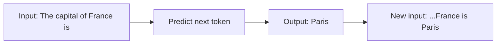
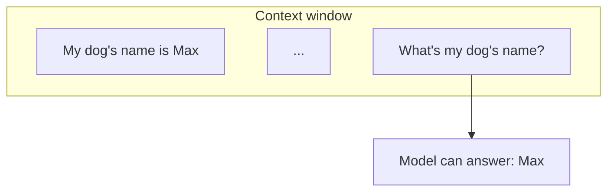
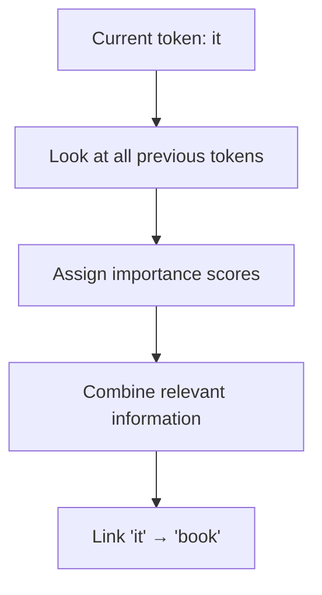
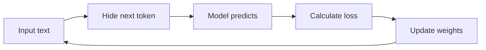
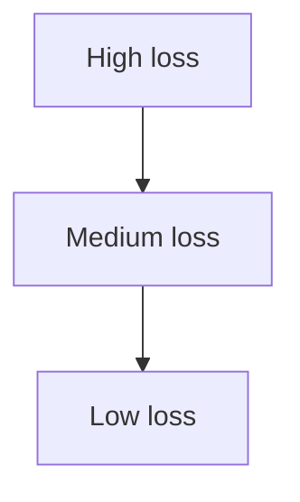
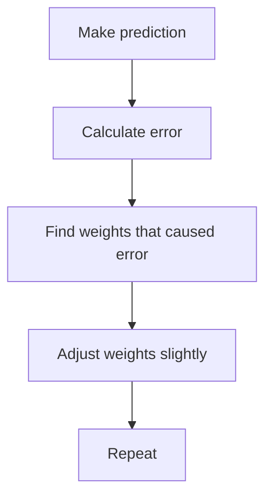
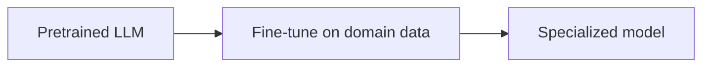
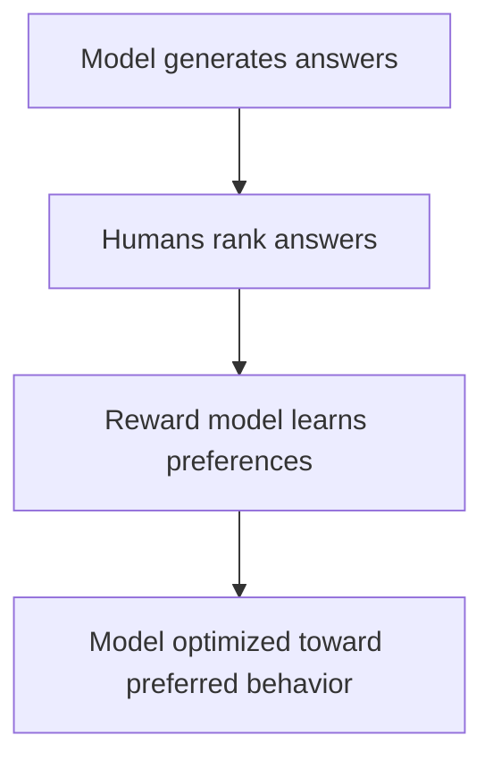
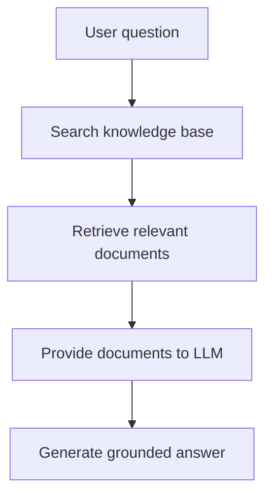

## The Core Goal of an LLM

An LLM is fundamentally a next-token prediction machine.

Given:

"The capital of France is"

the model estimates probabilities:

| Token  | Probability |
| ------ | ----------- |
| Paris  | 95%         |
| London | 2%          |
| Berlin | 1%          |



## Context Window

The model sees a sequence of tokens called the context.

Example:

User: My dog's name is Max.
...
User: What's my dog's name?

Because "Max" is inside the context window, the model can use it.

The context window is essentially the model's working memory during inference.



## Attention

Attention answers: **Which previous words should I focus on right now?**

Example:

```
John put the book on the table.
He picked it up later.
```

When processing "it", attention helps the model connect "it" to "book".



## Parameters

Parameters are the learned numbers inside the model.

A parameter is roughly a learned weight that influences predictions.

Training adjusts these weights to reduce prediction error.

## Training

Training consists of:

1. Take text.
2. Hide the next token.
3. Predict it.
4. Measure error.
5. Update weights.

Example:

```
Input:  "The sky is"
Target: " blue"
```

The model predicts: Green → error is calculated → weights are adjusted.

This process is repeated trillions of times.



## Loss Function

Lower loss means better predictions.





### Pretraining

Pretraining is where the model learns language itself.

Data may include: books, websites, articles, documentation, code.

The objective remains: **predict the next token**. No human labels are required.

## Fine-Tuning

After pretraining, models are often specialized.

Examples: coding assistants, medical assistants, legal assistants, customer support bots.

Fine-tuning teaches the model behaviors and domain knowledge beyond general language modeling.



## RLHF (Reinforcement Learning from Human Feedback)



## Hallucinations

LLMs do not store facts the way databases do.

They generate text that is statistically likely.

Sometimes this produces incorrect but plausible-sounding outputs, called **hallucinations**.

This happens because the model is optimizing for likely continuations, not guaranteed truth.

## Retrieval-Augmented Generation (RAG)

RAG combines document retrieval with text generation. It lets LLMs access external knowledge at answer time, improving factual accuracy.



See `ollama/rag.py` for a working local example.
