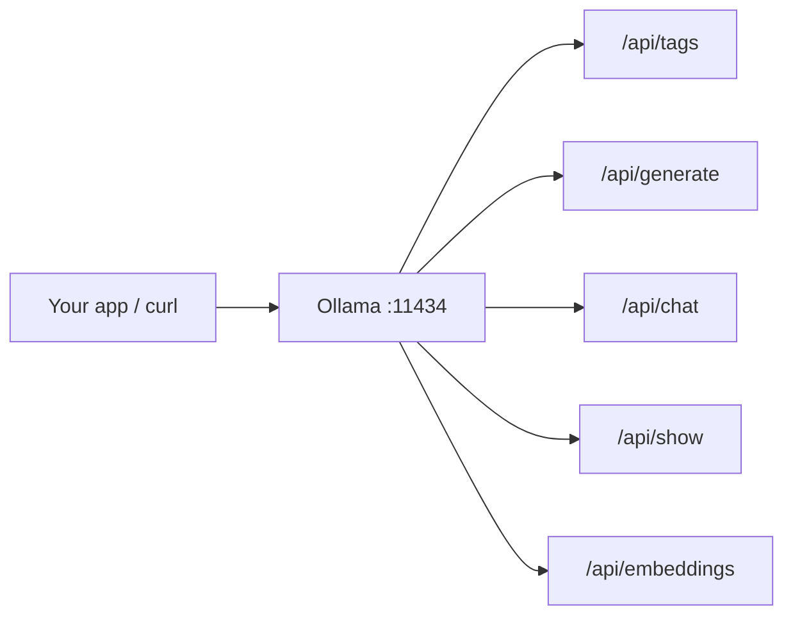
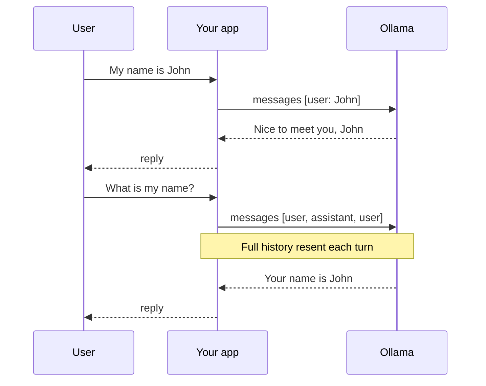

# Ollama API Reference

## Server

Ollama usually starts automatically. To verify:

```bash
ollama serve
```

Default base URL: `http://localhost:11434`

## API map



| Endpoint | Method | Purpose |
|----------|--------|---------|
| `/api/tags` | GET | List installed models |
| `/api/generate` | POST | Single-prompt text generation |
| `/api/chat` | POST | Multi-turn chat |
| `/api/show` | POST | Model details |
| `/api/embeddings` | POST | Text embeddings (for RAG) |

## List models

```http
GET http://localhost:11434/api/tags
```

## Text generation

```http
POST http://localhost:11434/api/generate
Content-Type: application/json
```

```json
{
  "model": "llama3.2",
  "prompt": "Explain machine learning in simple terms.",
  "stream": false
}
```

## Chat API

```http
POST http://localhost:11434/api/chat
Content-Type: application/json
```

```json
{
  "model": "llama3.2",
  "messages": [
    {
      "role": "user",
      "content": "What is Artificial Intelligence?"
    }
  ],
  "stream": false
}
```

## Multi-turn conversation



```json
{
  "model": "llama3.2",
  "messages": [
    { "role": "user", "content": "My name is John." },
    { "role": "assistant", "content": "Nice to meet you, John! How can I help you today?" },
    { "role": "user", "content": "What is my name?" }
  ],
  "stream": false
}
```

## Model information

```http
POST http://localhost:11434/api/show
```

```json
{
  "name": "llama3.2"
}
```

## Embeddings (used by `rag.py`)

```http
POST http://localhost:11434/api/embeddings
```

```json
{
  "model": "nomic-embed-text",
  "prompt": "What is XYZ ORG?"
}
```
