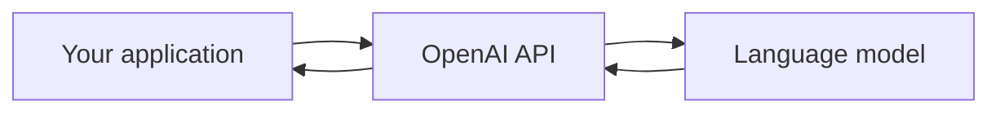
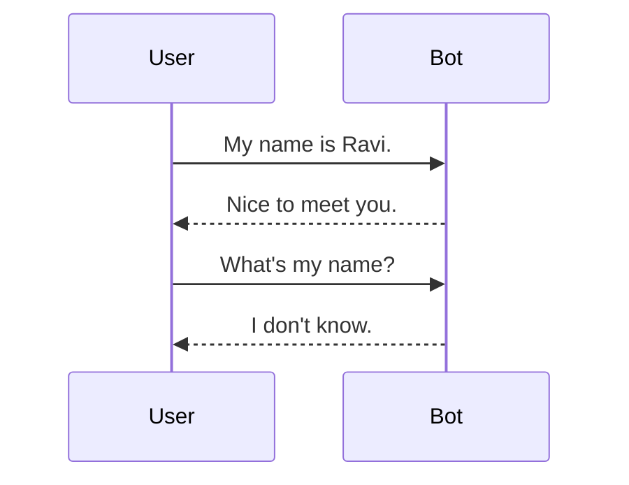
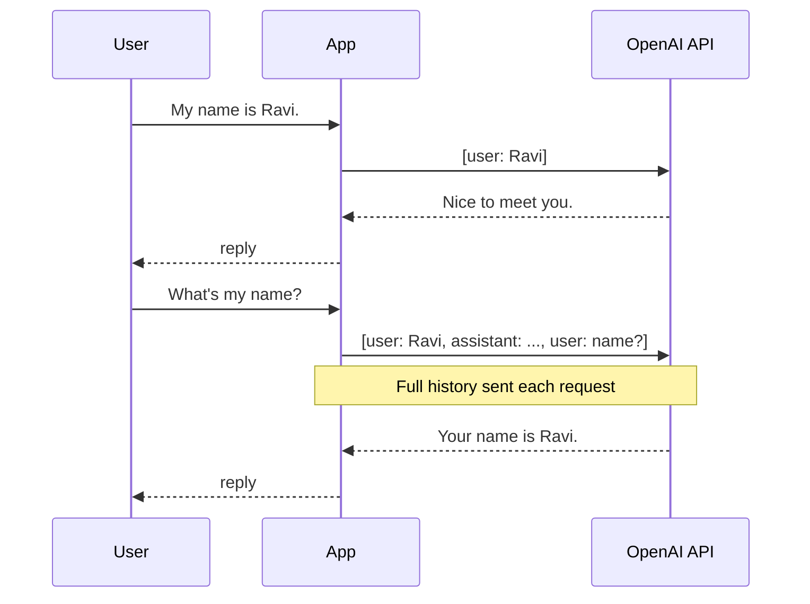

# OpenAI API Basics

The OpenAI API lets you add AI capabilities (text, images, audio, agents, and more) to your applications through HTTP requests or official SDKs.

## Setup

1. Sign up and create an API key in the dashboard.
2. Store it securely as an environment variable.
3. Never expose API keys in frontend code or public repositories.

Docs: https://developers.openai.com/api/docs/quickstart

## Chat completion API

The model is given a conversation and asked to "complete" it by generating the next assistant message.



### Message roles

| Role | Purpose |
|------|---------|
| `system` | Instructions for model behavior |
| `user` | Messages from the end user |
| `assistant` | Previous AI responses |
| `tool` / `function` | Outputs from external tools |

### Typical use cases

- Customer support chatbots
- Virtual assistants
- Content generation
- Coding assistants
- Data extraction and summarization
- AI agents that call tools and APIs

## Conversation memory

A chatbot remembers by **storing previous messages and sending them again with every new request**.

### Without memory



### With memory



### Minimal Python pattern

```python
chat_history = []

while True:
    user = input("You: ")
    chat_history.append({"role": "user", "content": user})

    # Send chat_history to API
    bot_reply = "AI response here"

    chat_history.append({"role": "assistant", "content": bot_reply})
    print("Bot:", bot_reply)
```

## Local equivalent

Ollama's `/api/chat` works the same way — see `06_using_api.md`.
