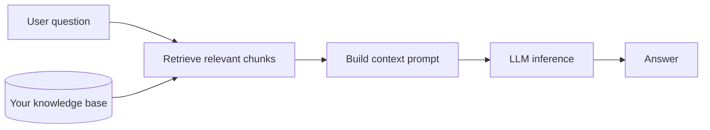
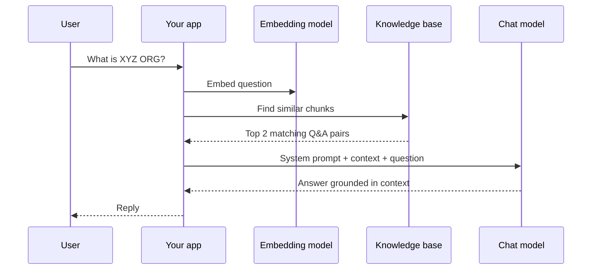
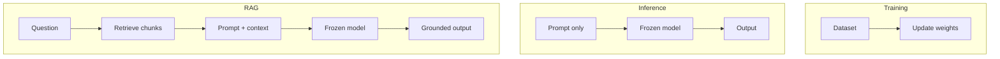

# RAG — Retrieval-Augmented Generation

RAG is a pattern for answering questions using **your own data** without retraining the model.

Instead of changing model weights, you **look up relevant documents** at question time and pass them to the model as context.

## The problem RAG solves

A base LLM only knows what it learned during training. It does not know:

- Your company's internal docs
- Data added yesterday
- Private information never in the training set

You could **fine-tune** the model on that data — but that is slow, expensive, and hard to update.

RAG offers a simpler path: **retrieve facts first, then generate an answer.**



## How RAG works (two steps)

### 1. Retrieval

Turn your documents into **chunks** and **embeddings** (see `02_Tokens_embeddings.md`).

When a question arrives:

1. Embed the question into a vector
2. Compare it to stored chunk vectors (cosine similarity)
3. Pick the top matches (`top_k`)

### 2. Augmented generation

Put the retrieved chunks into the prompt and ask the model to answer **using only that context**.



## RAG vs Training vs Inference

Training and inference are covered in `01_trainning_inference.md`. Here is how **RAG** fits alongside them.

| | **Training** | **Inference** | **RAG** |
|---|---|---|---|
| **What changes?** | Model weights | Nothing (weights frozen) | Nothing (weights frozen) |
| **What you add** | Labeled examples | A prompt | Retrieved documents + prompt |
| **When knowledge updates** | Re-train or fine-tune | N/A — model stays the same | Update your knowledge base |
| **Cost** | High (GPU, time) | Low per request | Low–medium (embed + chat call) |
| **Best for** | New behavior / tone / style | General chat, coding help | Q&A over your own docs |
| **This repo** | `ollama/train_model.py` | Ollama chat, flask-app | `ollama/rag.py` |



### One-line summary

| Approach | Plain English |
|----------|---------------|
| **Training** | Teach the model new skills by changing its brain |
| **Inference** | Ask the model a question with what it already knows |
| **RAG** | Hand the model the right notes before it answers |

## When to use which

| Goal | Use |
|------|-----|
| Answer from company docs / FAQs | **RAG** |
| Change writing style or task format | **Training / LoRA** |
| General chat with no custom data | **Inference** |
| Facts change often (policies, prices) | **RAG** — update data, not the model |
| Deep behavioral change on small data | **LoRA** (`train_model.py`) |

Most production apps combine them:

- **Base model** → inference
- **Your documents** → RAG
- **Optional fine-tune** → only when RAG + prompting is not enough

## Local lab: `ollama/rag.py`

Prerequisites:

```bash
ollama pull llama3.2
ollama pull nomic-embed-text
```

Run:

```bash
cd ollama
python rag.py
```

The script uses `data.json` as a mini knowledge base. For each question it:

1. Embeds all Q&A pairs once at startup
2. Retrieves the closest chunks to the question
3. Sends them to `llama3.2` with a strict system prompt

### QA-style checks to try

| Question | Expected behavior |
|----------|-------------------|
| "What is XYZ ORG?" | Answer from your data |
| "What is RAG?" | Answer from your data |
| "What is the capital of France?" | Should say it does not know (not in `data.json`) |

If the third case still hallucinates an answer, the retrieval or system prompt needs tightening — that is normal RAG debugging.

## RAG limitations (good to know)

- **Garbage in, garbage out** — bad chunks → bad answers
- **Retrieval misses** — right answer exists but was not retrieved
- **Context window** — only so much text fits in one prompt
- **Not a substitute for training** — RAG adds facts; it does not teach new reasoning style

## Related files in this repo

| File | Topic |
|------|-------|
| `01_trainning_inference.md` | Training vs inference basics |
| `02_Tokens_embeddings.md` | How embeddings power retrieval |
| `03_prompts.md` | System prompts that constrain RAG answers |
| `ollama/rag.py` | Minimal RAG implementation |
| `ollama/data.json` | Sample knowledge base |
| `rag.jpg`, `rag_arch.jpg` | Architecture diagrams |
