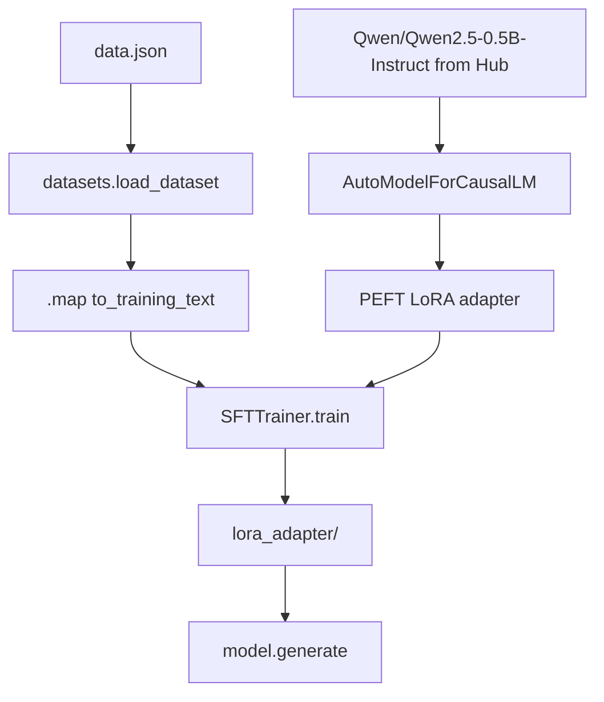

# `train_model.py` walkthrough

Read this after running `01`–`04`. Open `ollama/train_model.py` side by side.

## Imports (lines 9–13)

```python
import torch                          # tensors, no_grad, float32
from datasets import load_dataset     # load data.json
from peft import LoraConfig, get_peft_model   # LoRA adapters
from transformers import AutoModelForCausalLM, AutoTokenizer, TrainingArguments
from trl import SFTTrainer            # supervised fine-tuning trainer
```

| Import | You learned in |
|--------|----------------|
| `torch` | `01_tensors.py` |
| `AutoTokenizer` | `02_tokenizer.py` |
| `AutoModelForCausalLM`, `.generate()` | `03_load_and_generate.py` |
| `load_dataset`, `.map()` | `04_datasets.py` |
| `LoraConfig`, `SFTTrainer` | below |

---

## Data prep (lines 36–37)

```python
dataset = load_dataset("json", data_files=str(DATA_FILE), split="train")
dataset = dataset.map(to_training_text)
```

Turns each JSON row into one training string with `### Instruction` / `### Response` headers.

---

## Model + tokenizer (lines 40–44)

```python
tokenizer = AutoTokenizer.from_pretrained(MODEL_ID)
model = AutoModelForCausalLM.from_pretrained(MODEL_ID, dtype=torch.float32)
```

- **Causal LM** = predicts the next token (GPT-style).
- **float32** = full precision on CPU (no GPU required).

---

## LoRA — the key idea (lines 46–55)

**Problem:** Fine-tuning all 82M parameters of distilgpt2 is slow and heavy.

**LoRA (Low-Rank Adaptation):** Insert small trainable matrices into attention layers. Freeze the original weights; only train the adapter (~0.5% of params).

```python
lora_config = LoraConfig(
    r=8,                    # rank — adapter size (bigger = more capacity)
    lora_alpha=16,          # scaling factor
    target_modules=[...],   # which layers get adapters
    lora_dropout=0.05,
    task_type="CAUSAL_LM",
)
model = get_peft_model(model, lora_config)
```

`print_trainable_parameters()` shows how few params actually train.

---

## TrainingArguments (lines 57–67)

Hyperparameters for the training loop — you don't write the loop yourself; `SFTTrainer` does.

| Setting | Meaning |
|---------|---------|
| `per_device_train_batch_size=1` | 1 example per step (CPU-friendly) |
| `gradient_accumulation_steps=4` | simulate batch of 4 |
| `max_steps=60` | stop after 60 updates |
| `learning_rate=5e-4` | how big each weight update is |
| `warmup_steps=2` | ramp up learning rate slowly |

---

## SFTTrainer (lines 69–77)

**SFT** = Supervised Fine-Tuning. Show the model `(instruction, response)` pairs and train it to complete the response.

```python
trainer = SFTTrainer(model=model, processing_class=tokenizer, train_dataset=dataset, args=training_args)
trainer.train()
```

Under the hood: forward pass → loss → backward pass → update LoRA weights only.

---

## Save + test (lines 79–98)

```python
model.save_pretrained(ADAPTER_DIR)   # saves LoRA adapter, not full model
model.eval()
with torch.no_grad():
    generated = model.generate(...)
```

Same inference pattern as `03_load_and_generate.py`.

---

## Mental model



---

## What you can skip for now

- Exact math inside attention (`c_attn`, `c_proj`, `c_fc`)
- Gradient accumulation internals
- TensorFlow / Keras equivalents

If you can explain: **tensors → tokenizer → load model → LoRA → train → generate**, you understand enough to read and debug `train_model.py`.
