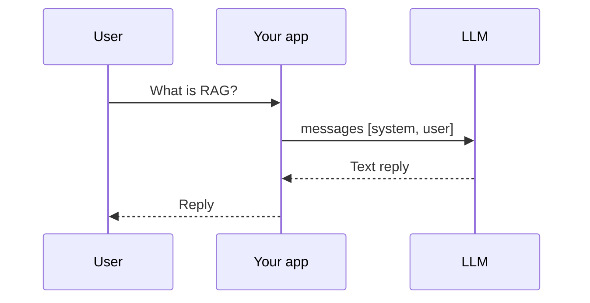
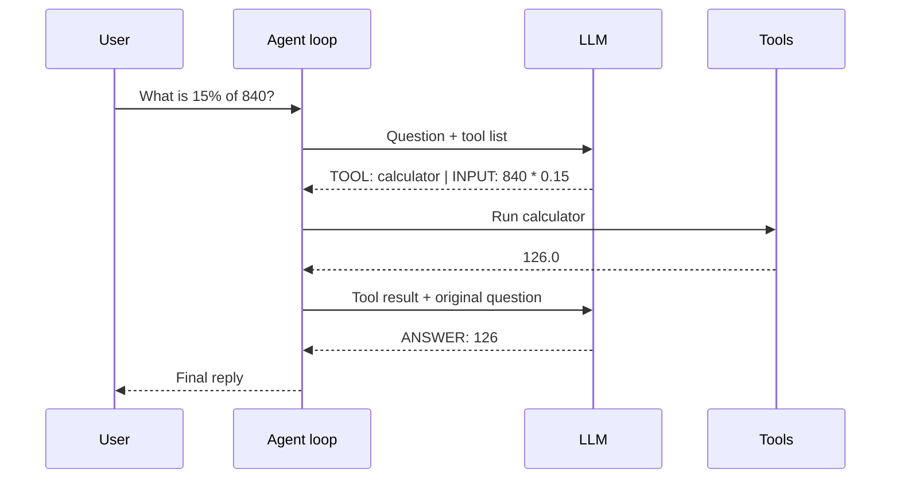
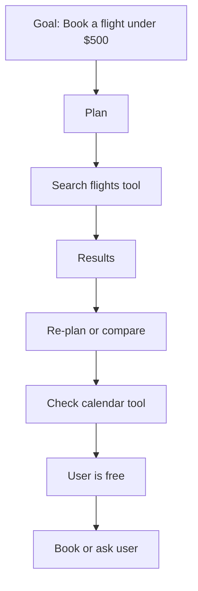
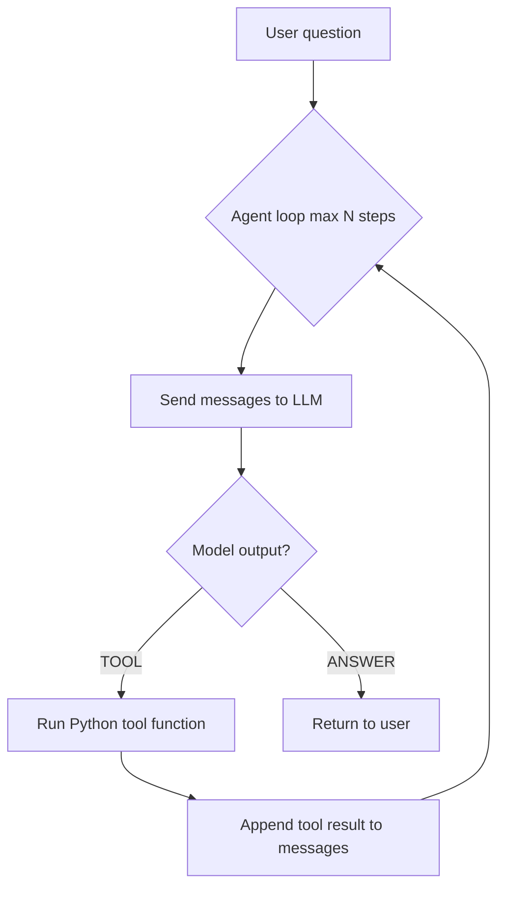

# AI Agents & Agentic AI

How a **normal chatbot** differs from an **AI agent**, and what people mean by **agentic AI** — with code in `13_agent_demo.py`.

## Normal chatbot

A chatbot takes a message (plus history) and returns **one text reply**. It does not run code, call APIs, or decide to take extra steps on its own.



**In this repo:** `flask-app` `/v1/chat` — same pattern as Ollama `/api/chat`.

| Trait | Chatbot |
|-------|---------|
| Steps per question | **1** (one LLM call) |
| Uses external tools | ❌ |
| Can fetch live data | ❌ (only what it memorized) |
| Good for | FAQ-style chat, writing help, Q&A on fixed context |

## AI agent

An **agent** = **LLM + tools + a loop**. The model can decide to call a function (calculator, database, API), read the result, and continue until it can answer.



| Trait | Agent |
|-------|-------|
| Steps per question | **1 or many** (loop) |
| Uses external tools | ✅ |
| Can fetch live data | ✅ (via tools) |
| Good for | Math, lookups, booking, code execution, workflows |

**Key idea:** Your **Python code** runs the loop — the LLM suggests actions; your app executes them safely.

## Agentic AI

**Agentic AI** is the broader label for systems that act with **goal-directed autonomy**:

- Plan steps toward a goal
- Choose and call tools
- Observe results and adjust
- Sometimes use **multiple agents** (researcher + coder + reviewer)



| Term | Meaning |
|------|---------|
| **Chatbot** | One-shot text in → text out |
| **AI agent** | LLM + tools + loop in **one** assistant |
| **Agentic AI** | Autonomous, multi-step (often multi-tool / multi-agent) systems |

Not every product labeled “agent” is truly agentic. If there is **no loop and no tools**, it is usually still a chatbot.

## Side-by-side comparison

| | Chatbot | Agent | Agentic system |
|---|---------|-------|----------------|
| Example | “Explain RAG” | “Calc 15% of 840” with calculator tool | “Plan my trip” → search → compare → book |
| LLM calls | 1 | 2–N | Many |
| Your code controls | Prompt + history | **Tool registry + loop + safety** | Orchestration, memory, guardrails |
| This repo | `flask-app`, `06_using_api.md` | `13_agent_demo.py` | Concept + future labs |

## RAG is not an agent (but pairs well)

| | RAG | Agent |
|---|-----|-------|
| Adds knowledge | Retrieves docs **before** one LLM call | Can retrieve **and** call other tools in a loop |
| Who decides steps | Your code (fixed pipeline) | LLM + loop logic |

See `10_rag.md`. RAG + agent together is common: agent chooses *when* to search docs vs run code.

## Coding pattern: chatbot

One request, one response:

```python
messages = [
    {"role": "system", "content": "You are a helpful assistant."},
    {"role": "user", "content": user_question},
]
reply = ollama_chat(messages)  # single call
```

## Coding pattern: agent loop



Core loop (simplified):

```python
messages = [system_prompt, user_question]

for step in range(MAX_STEPS):
    text = ollama_chat(messages)
    if text.startswith("ANSWER:"):
        return text
    if text.startswith("TOOL:"):
        name, arg = parse_tool_call(text)
        result = TOOLS[name](arg)
        messages.append({"role": "assistant", "content": text})
        messages.append({"role": "user", "content": f"Tool result: {result}"})
```

**Production extras:** JSON schema for tool calls, native API tool support (OpenAI/Gemini), timeouts, allowlists, human approval for dangerous actions.

## Run the local demo

Uses Ollama (same stack as `06_using_api.md`).

```bash
ollama pull llama3.2
pip install requests

python 13_agent_demo.py chatbot
python 13_agent_demo.py agent
```

| Command | Shows |
|---------|-------|
| `chatbot` | One LLM call — may guess wrong on math |
| `agent` | Tool loop — calculator + company lookup |

## QA checklist (good for your background)

| Test | Chatbot expected | Agent expected |
|------|------------------|----------------|
| “What is 17 × 23?” | May hallucinate a number | Calls `calculator`, returns 391 |
| “What is XYZ ORG?” | Generic guess | Calls `company_lookup` |
| “What is the capital of France?” | Often correct from training | Same — no tool needed |
| Tool fails / invalid JSON | N/A | Loop retries or stops gracefully |
| Max steps exceeded | N/A | Should not hang forever |

## Related files

| File | Topic |
|------|-------|
| `04_llm.md` | How the model generates text |
| `06_using_api.md` | Ollama chat API |
| `07_chatgpt_api.md` | `tool` / `function` message roles |
| `10_rag.md` | Retrieval before generation |
| `13_agent_demo.py` | Runnable chatbot vs agent |
| `flask-app/app.py` | Chatbot-style gateway |

## What to learn next

- Native **tool calling** in OpenAI / Gemini APIs  
- **Structured outputs** (JSON mode) for reliable tool parsing  
- **Guardrails** — which tools exist, rate limits, human-in-the-loop  
- Frameworks: LangGraph, CrewAI, OpenAI Agents SDK (optional — understand the loop first)
