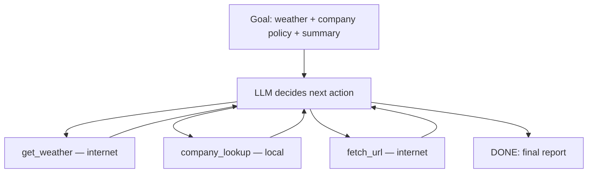
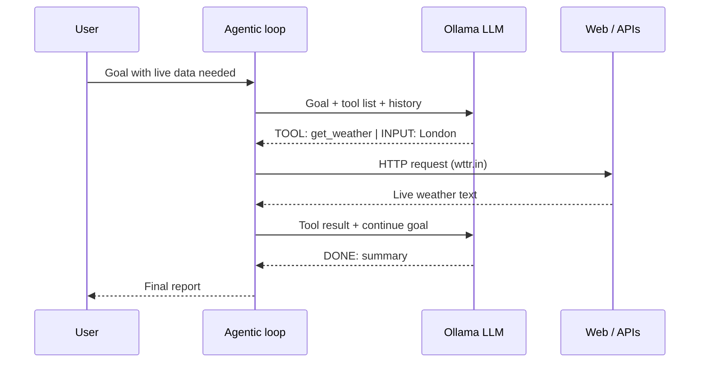

# Agentic AI — multi-step goals & internet tools

Builds on `13_ai_agents.md`. Here the system works toward a **bigger goal** using **many steps**, **several tools**, and optionally the **internet**.

## Progression in this repo

| # | Pattern | Example |
|---|---------|---------|
| `flask-app` | Chatbot | One chat call |
| `13_agent_demo.py` | Agent | One question → loop → tools → answer |
| **`14_agentic_demo.py`** | Agentic AI | One **goal** → plan → multiple tools (local + internet) → summary |



## Does the model “connect to the internet”?

**Not by itself.** Ollama (and most LLMs) have **no built-in network access**.

| What people say | What actually happens |
|-----------------|----------------------|
| “AI browsed the web” | **Your code** fetched a URL and passed text to the model |
| “ChatGPT searched Google” | OpenAI’s **tool** ran search; model read the result |
| “Gemini is online” | Google’s backend calls search APIs for you |

In `14_agentic_demo.py`, Python uses `requests` to hit the internet. The model only **decides** when to call `fetch_url` or `get_weather`.



## Agent vs agentic (this repo)

| | `13_agent_demo.py` | `14_agentic_demo.py` |
|---|-------------------|----------------------|
| Input | Single question | **Goal** (may need several facts) |
| Tools | Local only | Local **+ internet** |
| Max steps | 5 | 8 |
| Typical flow | 1–2 tool calls | 2–4+ tool calls, then synthesis |
| Internet | ❌ | ✅ `fetch_url`, `get_weather` |

## Tools in the demo

| Tool | Type | What it does |
|------|------|--------------|
| `get_weather` | Internet | Calls [wttr.in](https://wttr.in) (no API key) |
| `fetch_url` | Internet | GET a public URL (allowlisted for safety) |
| `company_lookup` | Local | Reads XYZ ORG facts (same idea as `13`) |
| `calculator` | Local | Math helper |

**Safety note:** Demo `fetch_url` only allows a few domains. In production you add timeouts, size limits, and domain allowlists.

## Run it

```bash
ollama pull llama3.2
pip install requests

python 14_agentic_demo.py
python 14_agentic_demo.py --goal "Check weather in Tokyo and XYZ ORG vacation policy, then advise if 5 days off is enough for a trip"
```

Default goal combines **live weather (internet)** + **local company data** + **written summary** — classic agentic pattern.

## QA-style checks

| Scenario | Expected |
|----------|----------|
| Goal mentions weather | Calls `get_weather` |
| Goal mentions XYZ ORG | Calls `company_lookup` |
| No network | Tool returns error; agent should still try to finish or explain |
| Model skips tools | May hallucinate — compare with `13` chatbot mode |

## Real-world parallels

| Product | Agentic + internet |
|---------|-------------------|
| ChatGPT + browsing | Search/fetch tools in a long loop |
| Perplexity | Search → read pages → cite sources |
| Travel bots | Flights API + calendar + budget check |
| Your demo | Weather API + local KB + summary |

## Related files

| File | Topic |
|------|-------|
| `13_ai_agents.md` | Chatbot vs agent |
| `13_agent_demo.py` | Single-question agent |
| `14_agentic_demo.py` | Multi-step + internet |
| `10_rag.md` | Fixed retrieve-then-answer (not a loop) |
| `06_using_api.md` | Ollama chat API |

## What to try next

- Add a **planning** step: LLM outputs `PLAN:` before tools  
- Chain **RAG** (`ollama/rag.py`) as one tool inside the loop  
- Swap Ollama **native tool calling** instead of `TOOL:` text format  
- Add **human approval** before any internet fetch in production
