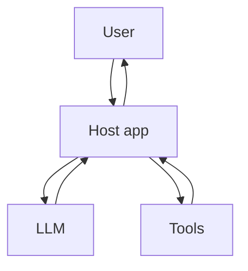
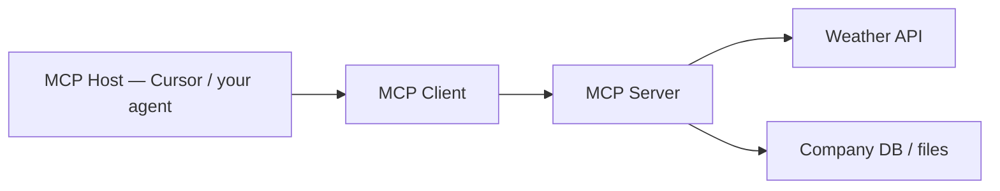

# MCP — Model Context Protocol

How **tools**, **agents**, and **MCP servers** fit together — and why the **model never acts alone**.

This file ties together everything from `13`–`14` and adds the **MCP** layer.

## The one rule (all AI websites)

**The model only reads text and writes text.** It does not browse, run code, or call APIs by itself.

| Layer | Who runs it | Examples |
|-------|-------------|----------|
| **LLM** | Ollama / OpenAI / Google / HF | Predicts next words |
| **App (host)** | Your Python, Cursor, ChatGPT backend | Agent loop, safety, UI |
| **Tools** | Your functions or MCP servers | Weather, search, Jira, files |

ChatGPT, Gemini, Cursor, your `14_agentic_demo.py` — **same architecture**, different scale.



## Learning ladder in this repo

| # | Pattern | File | Loop? | Tools? | Internet? |
|---|---------|------|-------|--------|-----------|
| — | Chatbot | `flask-app` | ❌ | ❌ | ❌ |
| 10 | RAG | `ollama/rag.py` | ❌ fixed pipeline | retrieve | optional |
| 13 | Agent | `13_agent_demo.py` | ✅ | ✅ local | ❌ |
| 14 | Agentic AI | `14_agentic_demo.py` | ✅ many steps | ✅ local + web | ✅ |
| **15** | **MCP** | `15_mcp_demo.py` | ✅ | ✅ via **MCP server** | ✅ |

## Chatbot vs agent vs agentic (quick recap)

| | Chatbot | Agent | Agentic AI |
|---|---------|-------|------------|
| **Calls to LLM** | 1 | 2–N | Many |
| **Tools** | No | Yes | Yes, many |
| **Goal** | Answer message | Answer question | Complete a project |
| **Example** | “Explain RAG” | “17 × 23?” + calculator | Weather + policy + summary |

See `13_ai_agents.md` and `14_agentic_ai.md` for full detail.

## Custom tools vs MCP

### File 14 — tools wired directly in Python

```python
TOOLS = {
    "get_weather": tool_get_weather,
    "company_lookup": tool_company_lookup,
}
result = TOOLS[name](payload)   # hardcoded in the agent script
```

Works for **one app only**. Copy-paste to reuse elsewhere.

### MCP — tools on a standard plug-in server



| Role | Job | Example |
|------|-----|---------|
| **Host** | AI app with the agent loop | Cursor, Claude Desktop, your `15_mcp_demo.py` |
| **Client** | Talks MCP protocol to servers | Built into host |
| **Server** | Exposes tools + resources | `15_mcp_server.py`, GitLab MCP, Slack MCP |

**Same agent loop.** Tools live on a **separate MCP server** any compatible host can plug into.

## What an MCP server exposes

| Type | Purpose | Example |
|------|---------|---------|
| **Tools** | Actions (read/write) | `get_weather`, `create_ticket` |
| **Resources** | Read-only data | file contents, doc URLs |
| **Prompts** | Reusable templates | “Write QA report” |

The LLM still never calls these directly — the **host** reads tool definitions, runs the server when the model asks, and feeds results back as text.

## MCP vs “the model has internet”

| Myth | Reality |
|------|---------|
| “ChatGPT browses the web” | OpenAI’s **tool** fetches pages → text goes into the prompt |
| “Gemini is connected to Google” | Google’s **backend** runs search → results in prompt |
| “Ollama agent went online” | **Your Python** or **MCP server** fetched data |

File `14` and `15` prove this: `requests` / MCP server does HTTP; Ollama only reads the result.

## Demo files

| File | What it shows |
|------|---------------|
| `15_mcp_demo.py` | Simulated MCP (Host → Client → Server) + Ollama agent loop |
| `15_mcp_server.py` | Real MCP server (FastMCP) — plug into Cursor |

### Run simulated demo (no extra deps beyond 13/14)

```bash
ollama pull llama3.2
pip install requests

python 15_mcp_demo.py
python 15_mcp_demo.py --compare    # direct TOOLS vs MCP side by side
```

### Run real MCP server (optional — for Cursor / Claude Desktop)

```bash
pip install mcp requests

python 15_mcp_server.py
```

Add to Cursor MCP settings (example):

```json
{
  "mcpServers": {
    "xyz-org-tools": {
      "command": "python",
      "args": ["/full/path/to/AI/15_mcp_server.py"]
    }
  }
}
```

Then Cursor’s agent can call `get_weather` and `company_lookup` through MCP instead of hardcoded tools.

## Architecture comparison

### 14 — direct tools

```
User → AgentHost → Ollama
              ↓
         TOOLS dict (inline Python)
```

### 15 — MCP tools

```
User → AgentHost → Ollama
         ↓
    MCP Client → MCP Server → weather / company APIs
```

The **loop is identical**. Only **where tools live** changes.

## Real-world MCP servers (you may already use them)

| MCP server | Tools / data |
|------------|--------------|
| GitLab MCP | Issues, MRs, pipelines |
| Atlassian MCP | Jira, Confluence |
| Slack MCP | Messages, channels |
| Filesystem MCP | Read local files |

Cursor connects as **host**; those services run as **MCP servers**.

## QA checklist for MCP-style systems

| Test | Expected |
|------|----------|
| Tool not on server | Clear error, no crash |
| Server offline | Host reports connection failure |
| Model skips tool | May hallucinate — same as file 13 |
| Wrong tool args | Server validates / returns error |
| Same tool, two hosts | Both Cursor and your script get same behavior |

## Related files

| File | Topic |
|------|-------|
| `13_ai_agents.md` | Chatbot vs agent |
| `13_agent_demo.py` | Agent loop, local tools |
| `14_agentic_ai.md` | Agentic + internet |
| `14_agentic_demo.py` | Direct TOOLS wiring |
| `15_mcp_demo.py` | MCP-style wiring |
| `15_mcp_server.py` | Real FastMCP server |
| `flask-app/app.py` | Chatbot (no tools) |

## Mental model for your notes

```
Chatbot     = talk once
Agent       = talk in a loop + tools
Agentic AI  = big goal + many steps + tools
MCP         = standard plug-in port for those tools
LLM         = brain that never touches the world directly
```

**One line:** MCP is **USB for AI tools** — the model still only thinks in text; the host talks to MCP servers that act in the real world.
