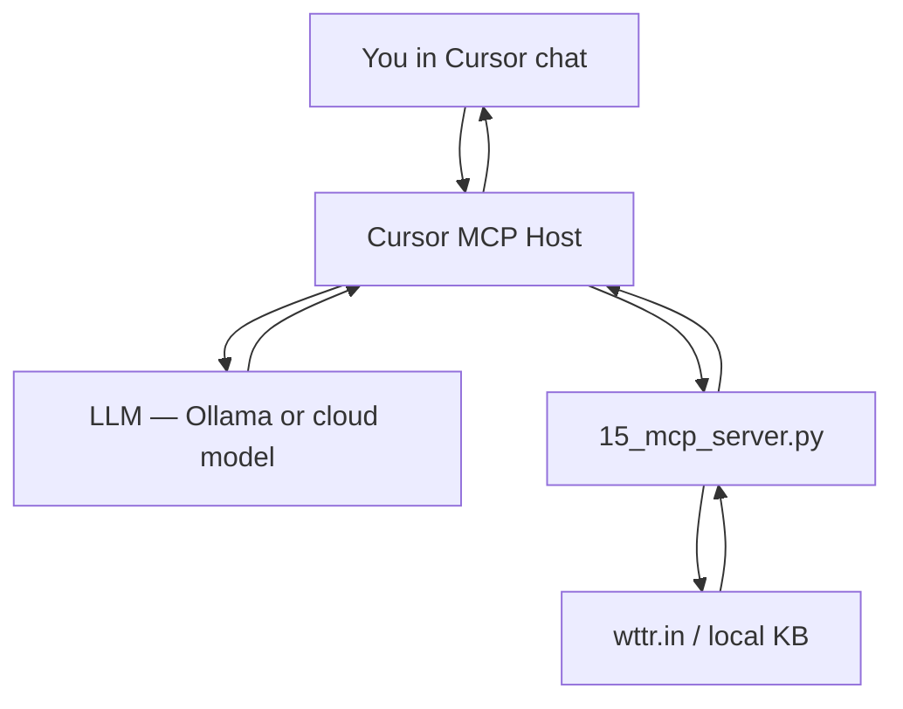
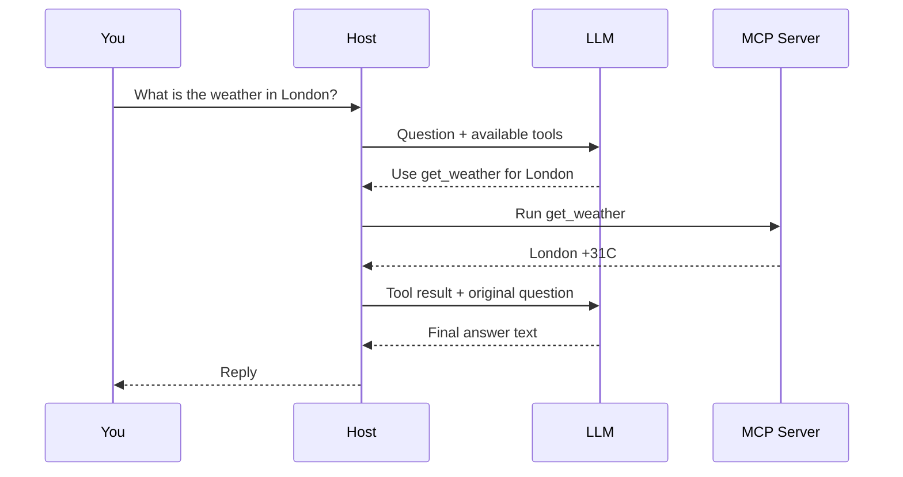
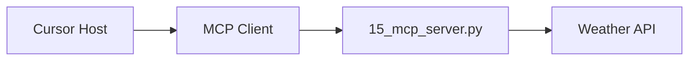

# MCP — Model Context Protocol

How **tools**, **agents**, and **MCP servers** fit together — and how this relates to **Ollama**.

## Important: MCP server ≠ LLM

`15_mcp_server.py` is **tools only**. It does **not** connect to Ollama and is **not** a chatbot.

| Piece | File / app | Job |
|-------|------------|-----|
| **LLM (brain)** | Ollama, Cursor model, OpenAI | Generates text |
| **MCP Host** | Cursor, Claude Desktop | Agent loop — connects LLM + tools |
| **MCP Server** | `15_mcp_server.py` | Exposes tools (weather, calculator, …) |


```mermaid
flowchart TB
    U[You in Cursor chat] --> H[Cursor MCP Host]
    H --> L[LLM — Ollama or cloud model]
    L --> H
    H --> S[15_mcp_server.py]
    S --> W[wttr.in / local KB]
    W --> S
    S --> H
    H --> U
```

**Ollama is not inside the MCP server.** Cursor (or your agent script) uses Ollama for thinking and the MCP server for acting.

## Does the MCP server need a model?

**No.** `15_mcp_server.py` has no LLM inside it — only Python tools (`get_weather`, `calculator`, etc.).

| Component | Model inside? |
|-----------|---------------|
| MCP server (`15_mcp_server.py`) | ❌ No |
| MCP host (Cursor, Claude Desktop) | ✅ Uses a model **separately** |
| Your agent scripts (`13`, `14`) | ✅ Ollama in the same file |

Adding MCP config to Cursor gives you **tools only**. It does **not** pick or install an LLM. Which model thinks is whatever Cursor (or your script) is already using.

## Who uses the model? Who runs the tools?

**The model does not run tools itself.** The **host** sits in the middle.


```mermaid
sequenceDiagram
    participant U as You
    participant H as Host
    participant L as LLM
    participant S as MCP Server

    U->>H: What is the weather in London?
    H->>L: Question + available tools
    L-->>H: Use get_weather for London
    H->>S: Run get_weather
    S-->>H: London +31C
    H->>L: Tool result + original question
    L-->>H: Final answer text
    H-->>U: Reply
```

| Who | Job |
|-----|-----|
| **Host** | Runs the loop, calls the LLM, **executes** tools |
| **LLM (model)** | Decides what to say and when a tool is needed |
| **MCP server** | Does the real work (HTTP, math, DB) |

**One line:** Host uses the model. Host runs tools when the model asks. The model never touches tools directly.

Same pattern in Cursor + MCP, ChatGPT, Gemini, and your `13_agent_demo.py`.

## Can MCP work without any LLM?

**The server still runs.** Tools still return data if you call them.

```text
No LLM:  You → call get_weather("London") → answer
         (you decide everything — no agent, no chat)
```

That works — but then MCP is just a **fancy API**. A plain Python function is enough. No “AI” involved.

**Why MCP exists:** for **LLM hosts** that must pick tools from natural language:

```text
With LLM:  You: "What's the weather in London?"
           → Host + LLM decides → get_weather
           → MCP server runs tool
           → LLM writes the answer
```

| Without LLM | With LLM |
|-------------|----------|
| You pick the tool | Model suggests which tool |
| Fixed steps | Flexible chat / agent |
| MCP is overkill | MCP makes sense |

MCP does not **include** a model. It **needs** a model **somewhere in the host** for the smart agent use case.

### Analogy

| Part | Like |
|------|------|
| **LLM** | Brain — understands “weather in London?” |
| **MCP server** | Hands — fetches weather |
| **Host** | Body — connects brain to hands |

No brain → hands still work, but **you** must tell them every step.

## Two ways to use Ollama + tools

| Approach | How | File |
|----------|-----|------|
| **All-in-one Python** | Your script calls Ollama + runs tools | `13_agent_demo.py`, `14_agentic_demo.py` |
| **Cursor + MCP** | Cursor's LLM + `15_mcp_server.py` as plug-in tools | `15_mcp_server.py` + Cursor config |

Use **13/14** for learning how the loop works. Use **15** to expose the same tools to Cursor (or any MCP host).

## Do NOT run the MCP server in a terminal

```bash
python 15_mcp_server.py   # WRONG for chatting — will show JSON errors
```

MCP speaks **JSON-RPC over stdin/stdout**. Only an **MCP host** (Cursor) should start the process.

If you see:

```text
Invalid JSON: EOF while parsing a value
```

That is normal when running it alone — there is no MCP client talking to it.

## Setup in Cursor

```bash
pip install -r 15_mcp_requirements.txt
ollama serve                  # optional — if using Ollama as Cursor's model
ollama pull llama3.2
```

Edit `~/.cursor/mcp.json` (use your real paths and venv Python):

```json
{
  "mcpServers": {
    "xyz-org-tools": {
      "command": "/home/vipikuma/my_data/temp/AI/ollama/.venv/bin/python",
      "args": ["/home/vipikuma/my_data/temp/AI/15_mcp_server.py"]
    }
  }
}
```

1. Restart Cursor  
2. Check MCP server shows as connected (Settings → MCP)  
3. Ask in chat: *"What is the weather in London?"* or *"What is 19 times 21?"*

Cursor's LLM picks the tool → MCP server runs it → result goes back to the LLM → you get the answer.

### Using Ollama as the LLM in Cursor

- MCP server handles **tools** only  
- **Which model thinks** is set in Cursor (model picker / settings)  
- If Cursor supports Ollama as a provider, point it at `http://localhost:11434`  
- If not, Cursor may use its default cloud model — MCP tools still work the same way

For a **fully local** stack without Cursor: use `13_agent_demo.py` (Ollama + tools in one script).

## Learning ladder in this repo

| # | Pattern | File | Loop? | Tools? |
|---|---------|------|-------|--------|
| — | Chatbot | `flask-app` | ❌ | ❌ |
| 13 | Agent | `13_agent_demo.py` | ✅ | ✅ inline Python |
| 14 | Agentic AI | `14_agentic_demo.py` | ✅ | ✅ inline + internet |
| **15** | **MCP tools** | `15_mcp_server.py` | — (host runs loop) | ✅ via MCP protocol |

## Custom tools vs MCP

### File 14 — tools in Python

```python
TOOLS = {"get_weather": tool_get_weather, ...}
result = TOOLS[name](payload)
```

Works in **one script only**.

### File 15 — tools on MCP server


```mermaid
flowchart LR
    H[Cursor Host] --> C[MCP Client]
    C --> S[15_mcp_server.py]
    S --> W[Weather API]
```

Same tools, **reusable** by any MCP host (Cursor, Claude Desktop, …).

## Tools in `15_mcp_server.py`

| Tool | Type | Description |
|------|------|-------------|
| `get_weather` | Internet | Live weather via wttr.in |
| `fetch_url` | Internet | Fetch allowlisted URLs |
| `company_lookup` | Local | XYZ ORG facts |
| `calculator` | Local | Math expressions |

## MCP vs “the model has internet”

The LLM never fetches URLs itself. The **MCP server** (your Python + `requests`) does — same rule as `14_agentic_demo.py`.

## Real-world MCP servers

| MCP server | Tools / data |
|------------|--------------|
| `15_mcp_server.py` | Weather, calculator, company lookup |
| GitLab MCP | Issues, MRs |
| Atlassian MCP | Jira, Confluence |
| Slack MCP | Messages |

## Related files

| File | Topic |
|------|-------|
| `13_ai_agents.md` | Chatbot vs agent |
| `13_agent_demo.py` | Ollama + tools in one script |
| `14_agentic_demo.py` | Agentic + internet |
| `15_mcp_server.py` | MCP tools for Cursor |
| `16_langchain.md` | LangChain as another glue layer |

## Mental model

```
Chatbot     = talk once
Agent       = loop + tools (13/14 — Ollama in same script)
MCP server  = toolbox only — no model inside (15)
MCP host    = uses model + runs tools (Cursor)
LLM         = brain — never touches the world directly
```

**One line:** `15_mcp_server.py` is the **toolbox** (no model). The **host** uses the **brain** (LLM) and **runs** the tools. Cursor connects them — do not expect the server to chat on its own.
