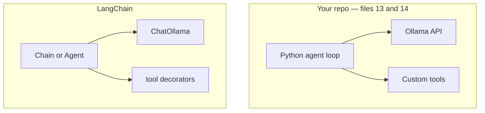

# LangChain — what it is and how to learn it

**LangChain** is a Python framework that **connects LLMs to prompts, memory, tools, and data** — so you write less glue code than in `13_agent_demo.py` / `14_agentic_demo.py`.

You already built agents by hand. LangChain (and **LangGraph**) are libraries that package those patterns.

## What you already built vs LangChain

| You wrote manually | LangChain gives you |
|--------------------|---------------------|
| `ollama_chat(messages)` | `ChatOllama` |
| System + user prompts as strings | `ChatPromptTemplate` |
| `TOOLS = {...}` dict | `@tool` decorators |
| `TOOL:` text parsing loop | `bind_tools()` + `tool_calls` |
| RAG retrieve → prompt | `VectorStore`, retrievers, chains |
| Agent loop | `AgentExecutor` / **LangGraph** graphs |



Same diagram in plain text (if Mermaid does not render):

```
Your repo (13/14):  Python loop → Ollama API + custom tools
LangChain:          Chain/Agent → ChatOllama + @tool functions
```

**Same architecture.** LangChain is **helper code**, not a different kind of AI.

## Core ideas

### 1. Components

| Component | Job |
|-----------|-----|
| **Model** | LLM wrapper (`ChatOllama`, `ChatOpenAI`) |
| **Prompt** | Template with variables |
| **Chain** | Steps wired together (`prompt \| llm`) |
| **Tool** | Function the model can call |
| **Memory** | Chat history across turns |
| **Retriever** | RAG — fetch relevant docs |

### 2. LCEL — LangChain Expression Language

Pipe syntax chains steps:

```python
chain = prompt | llm
answer = chain.invoke({"topic": "RAG"})
```

Like a mini pipeline — similar spirit to `ollama/rag.py` (steps in order).

### 3. Agents

LangChain agents = what you built in `13_agent_demo.py`:

```
LLM → (tool call?) → run tool → LLM → … → final answer
```

Modern LangChain often uses **LangGraph** for complex agentic flows (loops, branches, multi-agent).

## LangChain vs MCP vs your demos

| | Your `15_mcp_demo.py` | LangChain |
|---|----------------------|-----------|
| **Purpose** | Standard tool plug-in protocol | Python framework for LLM apps |
| **Tools** | MCP Server | `@tool` + `bind_tools()` |
| **Overlap** | Both used with agents | Can use MCP *through* LangChain adapters |

You can use **both**: LangChain as the app framework, MCP for external integrations.

## Learning path (this repo)

| Step | File | Learn |
|------|------|-------|
| 1 | `16_langchain_demo.py basic` | One LLM call |
| 2 | `16_langchain_demo.py chain` | Prompt template + chain |
| 3 | `16_langchain_demo.py tools` | Tools + loop (like file 13) |
| 4 | `ollama/rag.py` | RAG without LangChain (compare) |
| 5 | LangGraph docs | Multi-step agentic graphs |

Run:

```bash
ollama pull llama3.2
pip install -r 16_langchain_requirements.txt

python 16_langchain_demo.py basic
python 16_langchain_demo.py chain
python 16_langchain_demo.py tools
```

## When to use LangChain

| Use LangChain when… | Skip it when… |
|---------------------|---------------|
| You want faster prototyping | You want minimal dependencies |
| You need many integrations (OpenAI, Ollama, vector DBs) | Your hand-rolled loop is enough (13/14) |
| You’re building RAG + agents + memory together | You’re learning how agents work (do 13 first) |

**Recommendation:** Understand `13` and `14` first, *then* use LangChain to avoid rewriting the same glue.

## LangChain ecosystem

| Package | Role |
|---------|------|
| `langchain-core` | Base types, prompts, tools, runnables |
| `langchain-ollama` | Ollama chat models |
| `langchain-openai` | OpenAI / compatible APIs |
| `langchain-community` | Extra loaders, vector stores |
| `langgraph` | Stateful agent workflows (agentic AI) |

## Related files in this repo

| File | Relation to LangChain |
|------|----------------------|
| `13_agent_demo.py` | Manual agent — LangChain `tools` mode does this |
| `14_agentic_demo.py` | Manual agentic loop — LangGraph territory |
| `10_rag.md` + `ollama/rag.py` | Manual RAG — LangChain has retriever abstractions |
| `15_mcp.md` | MCP tools — can plug into LangChain hosts |
| `12_hg_model_bot.py` | HF `pipeline` — LangChain can wrap HF models too |

---

## Bonus: can `12_hg_model_bot.py` create images?

**No — not as written.** It uses:

```python
pipeline("text-generation", model="Qwen/Qwen2.5-0.5B-Instruct")
```

That pipeline only **generates text**. Qwen2.5-0.5B-Instruct is a **language** model, not an image model.

### HF pipeline types (different task = different model)

| Task | Pipeline type | Output |
|------|---------------|--------|
| Chat / completion | `text-generation` | Text |
| Sentiment | `sentiment-analysis` | Label + score |
| Translation | `translation` | Text |
| **Image generation** | **`text-to-image`** | **Image file** |
| Image caption | `image-to-text` | Text |

### Image generation example (separate from file 12)

```python
from diffusers import StableDiffusionPipeline
import torch

pipe = StableDiffusionPipeline.from_pretrained(
    "runwayml/stable-diffusion-v1-5",
    torch_dtype=torch.float16,
)
pipe = pipe.to("cuda")  # needs GPU for reasonable speed

image = pipe("a cat astronaut on the moon").images[0]
image.save("output.png")
```

Or smaller on CPU (slow):

```python
from transformers import pipeline

generator = pipeline("text-to-image", model="stabilityai/sd-turbo")
image = generator("a sunset over mountains")[0]
image.save("sunset.png")
```

### Practical notes for images locally

| Topic | Reality |
|-------|---------|
| **Text bot (file 12)** | Qwen instruct → words only |
| **Image models** | Stable Diffusion, FLUX, SD-Turbo — different weights |
| **CPU** | Text models OK; image gen is very slow on CPU |
| **GPU** | Recommended for image generation |
| **Ollama** | Mostly LLMs; not for Stable Diffusion-style images |
| **Easiest image API** | OpenAI DALL·E, Gemini Imagen, HF Inference API |

**One line:** Change the **pipeline task** and **model** for images — you cannot get images from a text-generation chatbot endpoint.

See `16_hf_image_demo.py` for a minimal optional image example (commented / GPU-aware).
