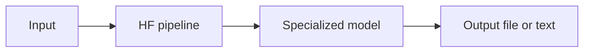
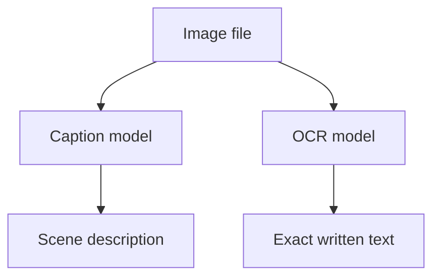

# Hugging Face multimodal — image, video, read text from images

Same rule as file **12** (text) and **17** (image):

> **Different task → different pipeline → different model.**

You do not swap one line in `12_hg_model_bot.py`. You pick the right **pipeline type**.

## The pattern (all HF media tasks)



| File | Input | Pipeline | Output |
|------|-------|----------|--------|
| `12_hg_model_bot.py` | Text prompt | `text-generation` | Text |
| `17_hf_image_demo.py` | Text prompt | `text-to-image` | PNG image |
| `18_hf_image_to_text_demo.py` | Image file | `image-to-text` | Text |
| `18_hf_video_demo.py` | Text prompt | `text-to-video` | MP4 video |

## Read text from images — is it the same as 17?

**Same idea, opposite direction.** Almost as easy in code.

| | File 17 (text → image) | File 18 (image → text) |
|---|------------------------|-------------------------|
| Direction | Write | Read |
| Pipeline | `text-to-image` | `image-to-text` |
| Difficulty | Medium (slow on CPU) | **Easier** (often works fine on CPU) |
| Use cases | Art, mockups | Captions, OCR, document QA |

### Two kinds of “reading” an image

| Type | Question it answers | Example output |
|------|---------------------|----------------|
| **Captioning** | “What is in this picture?” | “A dog on a beach” |
| **OCR** | “What words are written?” | “INVOICE #1234” |

Both use **image → text** models, but OCR models (e.g. TrOCR) are trained to read **exact text**, not describe the scene.



## Video generation — like 17 but heavier

| | Image (17) | Video (18) |
|---|------------|------------|
| Output | 1 PNG | Many frames → MP4 |
| Model size | Medium | Larger |
| CPU | Slow but possible | **Very slow** — GPU strongly recommended |
| Time to generate | Seconds–minutes | Minutes+ |

Text → video uses models like **Zeroscope** or **Stable Video Diffusion** (image-to-video variant needs a start image).

**Not the same model as 17** — video is its own pipeline (`text-to-video`).

## Run the demos

```bash
pip install -r 18_hf_requirements.txt

# 17 — text to image
python 17_hf_image_demo.py "sunset over mountains"

# 18 — image to text (caption or OCR)
python 18_hf_image_to_text_demo.py caption path/to/photo.jpg
python 18_hf_image_to_text_demo.py ocr path/to/screenshot.png
python 18_hf_image_to_text_demo.py ocr   # uses built-in sample image

# 18 — text to video (needs GPU for practical use)
python 18_hf_video_demo.py "a bird flying over the ocean"
```

## How this fits your learning repo

| You learned | Multimodal version |
|-------------|-------------------|
| LLM = text in → text out | Vision = image in → text out |
| Agent tools | “Read this screenshot” as a tool |
| RAG on docs | OCR image → text → chunk → retrieve |
| Chatbot | Multimodal chat (image + question) |

Gemini and ChatGPT do image understanding the same way: **vision model encodes image → text tokens → LLM reads them**. Your local demo uses smaller HF models.

## Practical tips

| Topic | Advice |
|-------|--------|
| Start with | `18_hf_image_to_text_demo.py` — easiest on CPU |
| Images | `17_hf_image_demo.py` — GPU helps a lot |
| Video | Try only if you have a GPU; expect long downloads |
| Production OCR | Also look at Tesseract, Google Vision API, Gemini vision |
| Production video | Runway, Pika, Sora APIs — local video gen is heavy |

## Related files

| File | Topic |
|------|-------|
| `12_hg_model_bot.py` | Text generation API |
| `17_hf_image_demo.py` | Text → image |
| `18_hf_image_to_text_demo.py` | Image → text (caption + OCR) |
| `18_hf_video_demo.py` | Text → video |
| `02_Tokens_embeddings.md` | Models turn everything into numbers |

## One-line summary

**17 writes pictures from words. 18 reads words from pictures (or makes short videos from words). Same HF `pipeline` pattern — different task name and model.**
