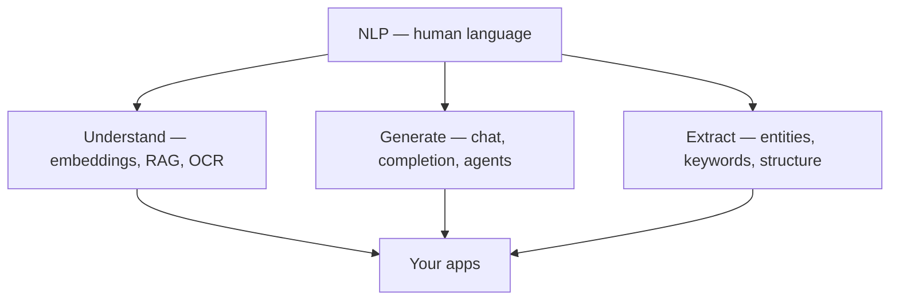
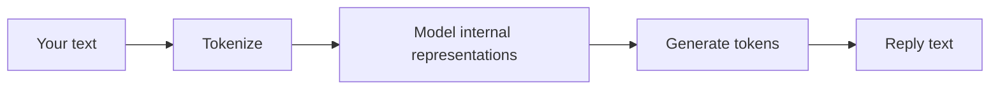

# NLP — Natural Language Processing (theory)

**NLP** is the field of teaching computers to work with **human language** — read it, understand it, generate it, and act on it.

You have been learning NLP the whole time in this repo. It was labeled **LLM**, **GenAI**, **RAG**, and **agents** instead of “NLP.” This file gives that work a name and a map.

## What NLP covers

| Branch | Question | Example |
|--------|----------|---------|
| **NLU** (understanding) | What does this text mean? | Sentiment, classification, RAG retrieval |
| **NLG** (generation) | What text should we produce? | Chat replies, summaries, code |
| **Information extraction** | What facts are in the text? | NER, OCR, parsing invoices |
| **Machine translation** | Same meaning, another language | English → Hindi |
| **Speech** (often grouped with NLP) | Audio ↔ text | Whisper, voice assistants |

Modern **LLMs** do many of these tasks in one model. That is why this repo focuses on LLMs rather than older NLP toolkits.



## Classic NLP vs LLM era

| Era | Approach | Tools | One model per task? |
|-----|----------|-------|---------------------|
| **Classic** | Rules + small ML models | NLTK, spaCy, TF-IDF | Often yes |
| **LLM (now)** | Large pre-trained models + prompts | Ollama, HF, OpenAI, Gemini | One model, many tasks |

### Classic NLP tasks (still valid concepts)

| Task | What it does | LLM-era equivalent |
|------|--------------|-------------------|
| **Tokenization** | Split text into pieces | `02_Tokens_embeddings.md`, tokenizers |
| **Sentiment analysis** | Positive / negative / neutral | Ask the LLM in a prompt |
| **Named Entity Recognition (NER)** | Find names, places, dates | LLM or specialized model |
| **Bag-of-words / TF-IDF** | Word counts for search | **Embeddings** (better) — `02` |
| **Topic modeling** | Themes in documents | RAG + clustering, or ask LLM |

You do **not** need NLTK/spaCy to be an applied NLP developer today — but knowing these terms helps when reading docs or job descriptions.

## How this repo maps to NLP

| # | File | NLP topic |
|---|------|-----------|
| 01 | `01_trainning_inference.md` | How language models learn and run |
| 02 | `02_Tokens_embeddings.md` | **Core NLP** — tokens, vectors, semantic similarity |
| 03 | `03_prompts.md` | Prompt design (how we talk to NLU/NLG models) |
| 04 | `04_llm.md` | Language models, context, next-token prediction |
| 06–09 | API docs + demos | Using NLP models via HTTP |
| 10 | `10_rag.md` | Retrieval + Q&A over text (NLU + NLG) |
| 12 | `12_hg_model_bot.py` | Text generation (NLG) |
| 13–14 | Agent demos | Language + tools + loops |
| 15 | `15_mcp.md` | Standard tool plug-ins for language agents |
| 16 | `16_langchain.md` | Framework glue for NLP apps |
| 17–18 | Image / video / OCR demos | **Multimodal** NLP (text + vision) |

**You already have an NLP learning path** — it is the LLM branch of the field.

## The NLP pipeline inside every LLM call

Every chat, RAG query, and agent step follows the same hidden pipeline:



| Step | You see it in repo |
|------|-------------------|
| Tokenize | `02`, `11_pytorch_basics/02_tokenizer.py` |
| Model math | `04_llm.md`, `01` inference |
| Generate | `flask-app`, `06_using_api.md`, `12` |
| Add knowledge | `10_rag.md`, `ollama/rag.py` |
| Add actions | `13`, `14`, `15` agents + tools |

## NLP vs related terms

| Term | Meaning | Relation to NLP |
|------|---------|-----------------|
| **NLP** | Broad field — all language AI | Umbrella |
| **NLU** | Understanding input | Subset of NLP |
| **NLG** | Generating output | Subset of NLP |
| **LLM** | Large language **model** | Technology used for NLP |
| **GenAI** | Generative AI (text, image, …) | Often means LLM + multimodal |
| **RAG** | Pattern for grounded answers | NLP application |
| **Agent** | LLM + tools + loop | NLP application |

## Where NLP stops and other AI begins

| Input type | Field | Example in repo |
|------------|-------|-----------------|
| Text | NLP | Most of this repo |
| Image → text | Vision + NLP | `18_hf_image_to_text_demo.py` |
| Text → image | Generative (not classic NLP) | `17_hf_image_demo.py` |
| Tabular data | Traditional ML | Not covered here |
| Audio → text | Speech NLP | Not covered here |

## Mental model for your notes

```
NLP        = computers + human language (the field)
LLM        = the main engine you use for NLP today
GenAI      = building apps that generate / understand content
Your repo  = applied NLP via Ollama, APIs, RAG, agents, MCP
```

## What to read next (in order)

1. `02_Tokens_embeddings.md` — foundation of all text NLP  
2. `04_llm.md` — how models generate language  
3. `10_rag.md` — understanding + generation over your data  
4. `13_ai_agents.md` — language models that use tools  

Optional deeper classic NLP (outside this repo): spaCy NER tutorial, Hugging Face `sentiment-analysis` pipeline — useful vocabulary, not required for your current path.

## One-line summary

**NLP is the science of language and computers; your repo teaches modern NLP through LLMs, RAG, and agents — you were doing NLP from file 01 onward.**
