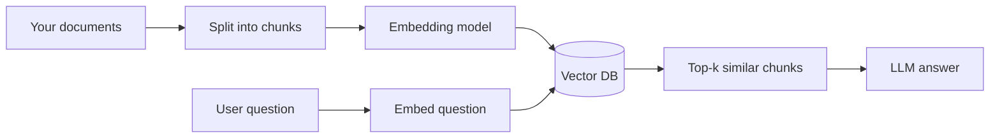
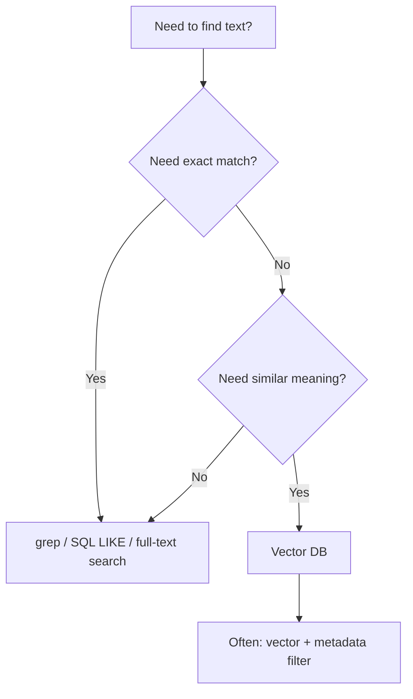

# Vector Databases

A vector database stores **text (or images, etc.) as embedding vectors** and finds items by **meaning**, not by exact keyword match.

It is **not grep**. Grep searches for literal strings. A vector DB searches for **semantically similar** content.

---

## The short answer

| | **grep / keyword search** | **Vector DB / semantic search** |
|---|---|---|
| **How it works** | Match exact text (`"leave policy"`) | Compare embedding vectors by distance |
| **Finds** | Lines containing those words | Text with similar *meaning* |
| **Example query** | `"vacation"` | `"How many days off do I get?"` |
| **Misses** | `"paid time off"` if you didn't search for it | Exact IDs, error codes, rare spellings |
| **Best for** | Logs, code, config files, known strings | RAG, docs Q&A, "find stuff like this" |

**Both are useful.** Production systems often combine them: vector search for meaning + keyword filter for precision.

---

## What problem does a vector DB solve?

In `ollama/rag.py`, you embed every chunk and store vectors in a Python list:

```python
chunks.append({"text": text, "embedding": embed(text)})
```

Then you loop and compute cosine similarity for every chunk. That works for **dozens** of documents.

A vector DB does the same job at **millions** of chunks:

- Persists vectors on disk (survives restarts)
- Uses indexes (HNSW, IVF, etc.) for fast nearest-neighbor search
- Stores metadata (source file, page, date) alongside each chunk
- Supports filters: *"similar to this question, but only from HR docs"*



See `02_Tokens_embeddings.md` for what embeddings are, and `10_rag.md` for the full RAG flow.

---

## What gets stored?

Each row (or "point") in a vector DB typically has:

| Field | Example |
|---|---|
| **id** | `"hr-policy-003"` |
| **document / text** | `"XYZ ORG offers 20 days paid leave..."` |
| **embedding** | `[0.12, -0.84, 0.31, ...]` (768–1536 floats) |
| **metadata** | `{"source": "handbook.pdf", "page": 4}` |

You **store** the original text so you can return it after search. The vector is only for finding it quickly.

---

## Vector DB vs regular database

| | **PostgreSQL / SQLite** | **Vector DB** |
|---|---|---|
| Query | `WHERE name = 'Alice'` | "Find rows *like* this sentence" |
| Index | B-tree on columns | Approximate nearest neighbor on vectors |
| Strength | Exact matches, joins, transactions | Semantic similarity at scale |

**pgvector** blurs the line — it adds vector columns to Postgres so you can use one DB for both.

---

## Popular options

| Tool | Type | Good for |
|---|---|---|
| **Chroma** | Local / embedded | Learning, prototypes, small apps |
| **FAISS** | Library (Meta) | In-process search, research |
| **pgvector** | Postgres extension | Apps already on Postgres |
| **Pinecone** | Managed cloud | Production without ops |
| **Qdrant / Weaviate** | Self-hosted or cloud | Production with more control |

For this repo, start with **Chroma** (local file) or keep using the manual list in `ollama/rag.py` until you outgrow it.

---

## How to use one (4 steps)

### 1. Chunk your documents

Split long PDFs/pages into ~300–800 token pieces with some overlap. One idea per chunk retrieves better.

### 2. Embed each chunk

Use an embedding model (e.g. Ollama `nomic-embed-text`):

```bash
ollama pull nomic-embed-text
```

### 3. Insert into the vector DB

```python
collection.add(
    ids=["chunk-1", "chunk-2"],
    documents=["XYZ ORG leave policy...", "RAG explained..."],
    metadatas=[{"source": "handbook"}, {"source": "10_rag.md"}],
)
```

The DB calls your embedding function (or you pass vectors yourself).

### 4. Query at question time

```python
results = collection.query(
    query_texts=["How many vacation days do employees get?"],
    n_results=3,
)
```

Returns the 3 chunks whose vectors are closest to the question — even if they never say "vacation days" exactly.

---

## Runnable demo

`22_vector_db_demo.py` does the same thing as `ollama/rag.py`, but uses **Chroma** instead of a Python list.

```bash
ollama pull nomic-embed-text
pip install -r 22_vector_db_requirements.txt
python 22_vector_db_demo.py
```

Try queries like:

- `"leave policy"` — keyword-ish, still works
- `"How many days off?"` — semantic; grep on raw docs might miss this
- `"What is RAG?"` — finds the RAG chunk

---

## When to use grep vs vector DB



| Use **grep / keyword** | Use **vector DB** |
|---|---|
| Find `ERROR 503` in logs | "Show me errors about payment timeouts" |
| Search for function name `calculate_tax` | "How do we handle EU tax?" |
| Config key `DATABASE_URL` | "What's our database setup?" |
| Small static FAQ (5 items) | Thousands of Confluence pages |

---

## Common mistakes

1. **Expecting exact matches** — Vector search is fuzzy. Use metadata filters or hybrid search for IDs and codes.
2. **Chunks too large** — Whole PDF as one vector = bad retrieval. Split first.
3. **No metadata** — You find a chunk but can't cite the source. Always store `source`, `page`, etc.
4. **Re-embedding on every startup** — Persist the DB; only re-embed when docs change.
5. **Skipping evaluation** — Test with real questions; check if the right chunk comes back.

---

## How this fits the repo

```
02_Tokens_embeddings.md   → what vectors are
10_rag.md + ollama/rag.py → RAG without a vector DB (manual cosine)
22_vector_db.md           → this file — production-style retrieval
22_vector_db_demo.py      → Chroma + Ollama demo
16_langchain.md           → LangChain VectorStore wrappers
```

---

**Summary**

- A **vector DB** stores embeddings + text + metadata and finds **similar meaning**, not exact strings.
- It is **not** a replacement for grep — it complements keyword search in RAG and doc Q&A.
- **`ollama/rag.py`** is RAG in ~50 lines; a vector DB is what you add when that list gets too big or needs to persist.
