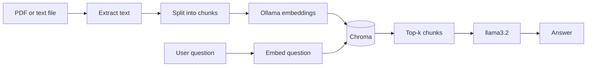

# PDF RAG — Document Chatbot

RAG over **real documents** (PDF, text, Markdown): load → chunk → embed → store in a vector DB → retrieve → answer with Ollama.

This extends `10_rag.md` (JSON knowledge base) and `22_vector_db.md` (Chroma).

---

## JSON RAG vs PDF RAG

| | `ollama/rag.py` | `23_pdf_rag_demo.py` |
|---|---|---|
| **Input** | Fixed `data.json` | PDF, `.txt`, `.md` files |
| **Chunking** | One row = one chunk | Split long docs by section |
| **Storage** | Python list in memory | Chroma (persistent on disk) |
| **Use case** | Learning RAG basics | Handbook / policy / report Q&A |



---

## Pipeline (4 steps)

### 1. Load

- **PDF** — `pypdf` extracts text per page
- **TXT / MD** — read as plain text

Scanned PDFs (images only) need **OCR** first — see `18_hf_image_to_text_demo.py`.

### 2. Chunk

Long documents do not fit in one embedding. Split by section or paragraph (~500 chars + overlap).

### 3. Index (vector DB)

Each chunk is embedded with Ollama `nomic-embed-text` and stored in **Chroma** (`chroma_pdf_rag_db/`).

Re-run indexing when the source file changes (`--reindex`).

### 4. Retrieve + generate

Same pattern as `10_rag.md`:

1. Embed the question
2. Query Chroma for top-k similar chunks
3. Pass chunks to `llama3.2` with a strict system prompt

---

## Run the demo

```bash
ollama pull llama3.2
ollama pull nomic-embed-text
pip install -r 23_pdf_rag_requirements.txt

# Sample handbook (included)
python 23_pdf_rag_demo.py

# Your own PDF
python 23_pdf_rag_demo.py path/to/handbook.pdf

# Rebuild index after editing a file
python 23_pdf_rag_demo.py --reindex path/to/handbook.pdf

# Retrieval only (no LLM call)
python 23_pdf_rag_demo.py --retrieve-only
```

### Sample questions (against `23_sample_docs/xyz_handbook.txt`)

| Question | Expected |
|----------|----------|
| "What is the leave policy?" | 20 days paid leave |
| "How many sick days?" | 10 days |
| "Can I work from home every day?" | No — up to 3 days/week |
| "Capital of France?" | Should say it does not know |

---

## Next steps

| Step | Tool |
|------|------|
| Web UI for upload + chat | Extend `streamlit-app/` |
| Trigger from automation | `24_n8n_automation.md` |
| Better chunking | LangChain `RecursiveCharacterTextSplitter` |
| Eval questions | Golden Q&A list + automated checks |

---

## Related files

| File | Topic |
|------|-------|
| `10_rag.md` | RAG concepts |
| `22_vector_db.md` | Vector DB theory |
| `22_vector_db_demo.py` | Chroma basics |
| `23_pdf_rag_demo.py` | This lab |
| `23_sample_docs/xyz_handbook.txt` | Sample document |
| `24_n8n_automation.md` | Wire RAG into workflows |

---

**Summary:** PDF RAG = same retrieval idea as `rag.py`, but for **arbitrary documents** with **chunking** and a **persistent vector DB**.
