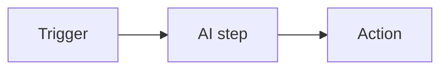

# AI Automation with n8n (free, self-hosted)

**n8n** is an open-source workflow tool you run locally or on your own server. It wires **triggers → AI steps → actions** without paid SaaS like Zapier.

This repo uses **n8n + Ollama** so automations stay **free** and data can stay on your machine.

---

## What is AI automation?



| Trigger | AI step | Action |
|---------|---------|--------|
| Webhook (form submit) | Ollama summarize | Return JSON response |
| Schedule (every hour) | Ollama classify | Write to file / DB |
| Manual test button | Ollama draft reply | Send email node |

**n8n** handles the wiring. **Ollama** (`06_using_api.md`) handles the AI — no cloud API key required.

---

## n8n vs Python in this repo

| | **n8n** | **Python** (`08`, `13`, `28`) |
|---|---|---|
| **Cost** | Free (self-hosted) | Free |
| **Best for** | Quick integrations, webhooks, schedules | RAG, agents, tests, custom logic |
| **Visual** | Drag-and-drop canvas | Code |
| **Version control** | Export workflow JSON to Git | Native Git |
| **PDF RAG chatbot** | Possible via HTTP to your script | `23_pdf_rag_demo.py` |

Use **n8n** when you want triggers and glue. Use **Python** when you need RAG, agents, or unit tests.

---

## Prerequisites

```bash
# Node.js 18+ (for npx)
node --version

# Ollama running locally
ollama serve
ollama pull llama3.2
```

---

## Step 1 — Install and start n8n

**Option A — npx (fastest for learning)**

```bash
npx n8n
```

Open **http://localhost:5678** and create a local owner account (stored on your machine).

**Option B — Docker**

```bash
docker volume create n8n_data
docker run -it --rm \
  --name n8n \
  -p 5678:5678 \
  -v n8n_data:/home/node/.n8n \
  docker.n8n.io/n8nio/n8n
```

**Option C — npm global**

```bash
npm install -g n8n
n8n start
```

---

## Step 2 — Workflow: Webhook → Ollama → Respond

**Goal:** POST a question to n8n; get an LLM answer from local Ollama.

### 2.1 Create workflow

1. Open n8n → **Add workflow** → name it `Ollama Webhook Chat`
2. Click **Add first step**

### 2.2 Node 1 — Webhook (trigger)

1. Search **Webhook** → select **Webhook**
2. Settings:
   - **HTTP Method:** `POST`
   - **Path:** `ask` (URL becomes `http://localhost:5678/webhook/ask`)
3. **Listen for test event** — leave this on for now
4. Save the node

### 2.3 Node 2 — HTTP Request (call Ollama)

1. Add node → **HTTP Request**
2. Connect Webhook output → HTTP Request input
3. Settings:
   - **Method:** `POST`
   - **URL:** `http://host.docker.internal:11434/api/chat`  
     - If n8n runs via **npx on the same machine**, use `http://127.0.0.1:11434/api/chat`
   - **Send Body:** ON
   - **Body Content Type:** JSON
   - **Specify Body:** Using JSON
   - **JSON:**

```json
{
  "model": "llama3.2",
  "stream": false,
  "messages": [
    {
      "role": "user",
      "content": "={{ $json.body.question }}"
    }
  ]
}
```

> The expression `={{ $json.body.question }}` reads the `question` field from the webhook POST body.

### 2.4 Node 3 — Respond to Webhook

1. Add node → **Respond to Webhook**
2. Connect HTTP Request → Respond to Webhook
3. Settings:
   - **Respond With:** JSON
   - **Response Body:**

```json
{
  "answer": "={{ $json.message.content }}"
}
```

(Ollama chat response puts the reply in `message.content`.)

### 2.5 Activate and test

1. **Save** workflow
2. Toggle **Active** (top right)
3. In a terminal:

```bash
curl -X POST http://localhost:5678/webhook/ask \
  -H "Content-Type: application/json" \
  -d '{"question": "Explain RAG in one sentence."}'
```

Expected: JSON with an `answer` field from Ollama.

### Troubleshooting

| Problem | Fix |
|---------|-----|
| Connection refused to Ollama | Ensure `ollama serve` is running |
| Docker n8n can't reach Ollama | Use `host.docker.internal:11434` instead of `127.0.0.1` |
| Empty `question` | POST body must be `{"question": "..."}` |
| Workflow not firing | Workflow must be **Active**; use production webhook URL if shown |

---

## Step 3 — Workflow: Summarize text (manual test)

**Goal:** Paste text in n8n → get a 3-bullet summary.

1. **Manual Trigger** node (for testing without webhook)
2. **Set** node — add field `text` with sample content
3. **HTTP Request** → Ollama `/api/chat` with prompt:

```json
{
  "model": "llama3.2",
  "stream": false,
  "messages": [
    {
      "role": "system",
      "content": "Summarize in exactly 3 bullet points."
    },
    {
      "role": "user",
      "content": "={{ $json.text }}"
    }
  ]
}
```

4. **Set** node — map `$json.message.content` to `summary`
5. Click **Test workflow** and inspect output

Same prompt ideas as `03_prompts.md`, but running inside n8n.

---

## Step 4 — Workflow: Schedule + classify

**Goal:** Every day at 9:00, send sample text to Ollama for classification.

1. **Schedule Trigger** — cron `0 9 * * *`
2. **Set** — field `text`: `"Customer wants refund for order #1234"`
3. **HTTP Request** → Ollama with system prompt:

```
Classify as: sales, support, or billing. Reply with one word only.
```

4. **IF** node — branch on `$json.message.content` contains `support`
5. Optional: **Write to file** or **Send Email** on each branch

This replaces paid "router" tools with free nodes.

---

## Step 5 — Call your Python RAG from n8n

n8n should **trigger** your code, not replace RAG logic.

Pattern:

1. **Webhook** receives `{"question": "..."}`
2. **HTTP Request** → your Flask/FastAPI endpoint that wraps `23_pdf_rag_demo.py` retrieval + answer
3. **Respond to Webhook** with the answer

Keep PDF chunking and Chroma in Python; use n8n as the front door for forms, cron jobs, or other apps.

---

## Step 6 — Export workflow to Git

1. Open workflow → **⋯** menu → **Download**
2. Save JSON in this repo (e.g. `n8n_workflows/ollama_webhook.json`)
3. Commit so workflows are version-controlled

---

## Hands-on checklist

- [ ] Install n8n (`npx n8n`)
- [ ] Build **Webhook → Ollama → Respond** (Step 2)
- [ ] Test with `curl`
- [ ] Build **Manual → Summarize** (Step 3)
- [ ] Optional: **Schedule → Classify → IF** (Step 4)
- [ ] Export workflow JSON to the repo
- [ ] Compare same summarize prompt in `08`/`09` Python vs n8n

---

## Security notes

- n8n webhooks on `localhost` are fine for learning; add **auth** before exposing publicly
- Do not put API keys in node JSON — use n8n **Credentials** or environment variables
- Prefer **local Ollama** for sensitive text (`06_using_api.md`)
- Log inputs/outputs when debugging — same QA mindset as `13_ai_agents.md`

---

## Related files

| File | Topic |
|------|-------|
| `03_prompts.md` | Prompts for AI steps |
| `06_using_api.md` | Ollama HTTP API used by n8n |
| `08_chatgpt_api_uses.py` | Code-first alternative |
| `13_agent_demo.py` | Multi-step tool loops in Python |
| `15_mcp.md` | IDE automation (different from n8n) |
| `23_pdf_rag_demo.py` | RAG stays in Python; n8n triggers it |

---

**Summary:** Use **n8n** (free, self-hosted) for triggers and glue. Use **Ollama** for AI steps. Use **Python** in this repo for RAG, agents, and anything you need to test in Git.
